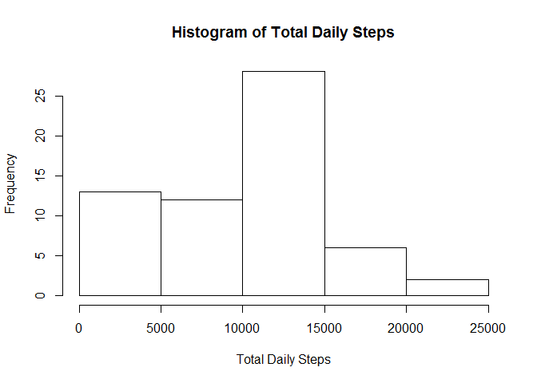
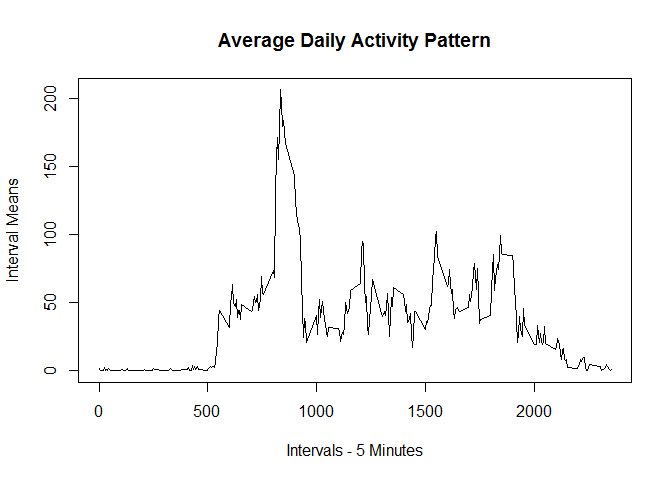
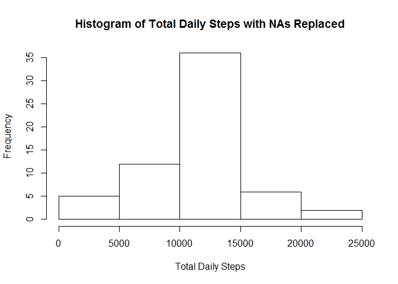
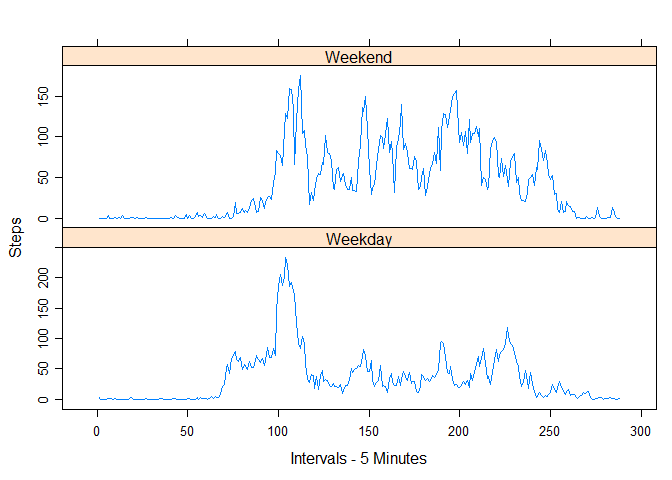

# Reproducible Research: Peer Assessment 1


## Loading and preprocessing the data

We will import this as a CSV file and leave it as is for this analysis. Let's also make sure everything in each column is in the right format. 


```r
activitydata<-read.csv("activity.csv")
activitydata$steps<-as.numeric(activitydata$steps)
head(activitydata)
```

```
##   steps       date interval
## 1    NA 2012-10-01        0
## 2    NA 2012-10-01        5
## 3    NA 2012-10-01       10
## 4    NA 2012-10-01       15
## 5    NA 2012-10-01       20
## 6    NA 2012-10-01       25
```

```r
summary(activitydata)
```

```
##      steps                date          interval     
##  Min.   :  0.00   2012-10-01:  288   Min.   :   0.0  
##  1st Qu.:  0.00   2012-10-02:  288   1st Qu.: 588.8  
##  Median :  0.00   2012-10-03:  288   Median :1177.5  
##  Mean   : 37.38   2012-10-04:  288   Mean   :1177.5  
##  3rd Qu.: 12.00   2012-10-05:  288   3rd Qu.:1766.2  
##  Max.   :806.00   2012-10-06:  288   Max.   :2355.0  
##  NA's   :2304     (Other)   :15840
```

```r
class(activitydata$steps)
```

```
## [1] "numeric"
```

```r
class(activitydata$date)
```

```
## [1] "factor"
```

```r
class(activitydata$interval)
```

```
## [1] "integer"
```

## What is mean total number of steps taken per day?

Here is a histogram for the total number of steps taken each day:


```r
totaldailysteps<-tapply(activitydata$steps,activitydata$date,sum,na.rm=TRUE)
hist(totaldailysteps, xlab = "Total Daily Steps", main = "Histogram of Total Daily Steps")
```

 

Here are the medians of the total number of steps taken each day:

```r
allmedians<-tapply(activitydata$steps,activitydata$date,median,na.rm=TRUE)
write.table(allmedians,quote = FALSE,col.names="Medians")
```

```
## Medians
## 2012-10-01 NA
## 2012-10-02 0
## 2012-10-03 0
## 2012-10-04 0
## 2012-10-05 0
## 2012-10-06 0
## 2012-10-07 0
## 2012-10-08 NA
## 2012-10-09 0
## 2012-10-10 0
## 2012-10-11 0
## 2012-10-12 0
## 2012-10-13 0
## 2012-10-14 0
## 2012-10-15 0
## 2012-10-16 0
## 2012-10-17 0
## 2012-10-18 0
## 2012-10-19 0
## 2012-10-20 0
## 2012-10-21 0
## 2012-10-22 0
## 2012-10-23 0
## 2012-10-24 0
## 2012-10-25 0
## 2012-10-26 0
## 2012-10-27 0
## 2012-10-28 0
## 2012-10-29 0
## 2012-10-30 0
## 2012-10-31 0
## 2012-11-01 NA
## 2012-11-02 0
## 2012-11-03 0
## 2012-11-04 NA
## 2012-11-05 0
## 2012-11-06 0
## 2012-11-07 0
## 2012-11-08 0
## 2012-11-09 NA
## 2012-11-10 NA
## 2012-11-11 0
## 2012-11-12 0
## 2012-11-13 0
## 2012-11-14 NA
## 2012-11-15 0
## 2012-11-16 0
## 2012-11-17 0
## 2012-11-18 0
## 2012-11-19 0
## 2012-11-20 0
## 2012-11-21 0
## 2012-11-22 0
## 2012-11-23 0
## 2012-11-24 0
## 2012-11-25 0
## 2012-11-26 0
## 2012-11-27 0
## 2012-11-28 0
## 2012-11-29 0
## 2012-11-30 NA
```

Here are the means of the total number of steps take each day:

```r
allmeans<-tapply(activitydata$steps,activitydata$date,mean,na.rm=TRUE)
write.table(allmeans,quote = FALSE,col.names="Means")
```

```
## Means
## 2012-10-01 NA
## 2012-10-02 0.4375
## 2012-10-03 39.4166666666667
## 2012-10-04 42.0694444444444
## 2012-10-05 46.1597222222222
## 2012-10-06 53.5416666666667
## 2012-10-07 38.2465277777778
## 2012-10-08 NA
## 2012-10-09 44.4826388888889
## 2012-10-10 34.375
## 2012-10-11 35.7777777777778
## 2012-10-12 60.3541666666667
## 2012-10-13 43.1458333333333
## 2012-10-14 52.4236111111111
## 2012-10-15 35.2048611111111
## 2012-10-16 52.375
## 2012-10-17 46.7083333333333
## 2012-10-18 34.9166666666667
## 2012-10-19 41.0729166666667
## 2012-10-20 36.09375
## 2012-10-21 30.6284722222222
## 2012-10-22 46.7361111111111
## 2012-10-23 30.9652777777778
## 2012-10-24 29.0104166666667
## 2012-10-25 8.65277777777778
## 2012-10-26 23.5347222222222
## 2012-10-27 35.1354166666667
## 2012-10-28 39.7847222222222
## 2012-10-29 17.4236111111111
## 2012-10-30 34.09375
## 2012-10-31 53.5208333333333
## 2012-11-01 NA
## 2012-11-02 36.8055555555556
## 2012-11-03 36.7048611111111
## 2012-11-04 NA
## 2012-11-05 36.2465277777778
## 2012-11-06 28.9375
## 2012-11-07 44.7326388888889
## 2012-11-08 11.1770833333333
## 2012-11-09 NA
## 2012-11-10 NA
## 2012-11-11 43.7777777777778
## 2012-11-12 37.3784722222222
## 2012-11-13 25.4722222222222
## 2012-11-14 NA
## 2012-11-15 0.142361111111111
## 2012-11-16 18.8923611111111
## 2012-11-17 49.7881944444444
## 2012-11-18 52.4652777777778
## 2012-11-19 30.6979166666667
## 2012-11-20 15.5277777777778
## 2012-11-21 44.3993055555556
## 2012-11-22 70.9270833333333
## 2012-11-23 73.5902777777778
## 2012-11-24 50.2708333333333
## 2012-11-25 41.0902777777778
## 2012-11-26 38.7569444444444
## 2012-11-27 47.3819444444444
## 2012-11-28 35.3576388888889
## 2012-11-29 24.46875
## 2012-11-30 NA
```
## What is the average daily activity pattern?

Fist, we will extract the average number of steps per interval. Then we will plot the daily activity pattern.


```r
intervalmean<-tapply(activitydata$steps,activitydata$interval,mean,na.rm=TRUE)
plot(x=dimnames(intervalmean)[[1]],y=intervalmean,type="l", main = "Average Daily Activity Pattern", xlab = "Intervals - 5 Minutes", ylab = "Interval Means")
```

 

The following 5-minute interval, on average across all the days in the dataset, contains the maximum number of steps:


```r
names(which.max(intervalmean))
```

```
## [1] "835"
```

## Imputing missing values

There seems to be a notable number of missing values. Let's take a look:

```r
sum(is.na(activitydata$steps))
```

```
## [1] 2304
```
Let's try to fill the missing values with the means for that interval. First, we will create a copy of the data set so we can fill it. Next, we will create a loop to replace the NAs. 


```r
activitydata2<-activitydata

for(i in 1:nrow(activitydata2))
    {
        if(is.na(activitydata2$steps[i]))
        {
            k<-activitydata2$interval[i]
            k<-as.character(k)
            activitydata2$steps[i]=intervalmean[intervalmean=k]
        }
    }
```

Let's see how filling in the missing values affected the data.


```r
totaldailysteps2<-tapply(activitydata2$steps,activitydata2$date,sum)
hist(totaldailysteps2, xlab = "Total Daily Steps", main = "Histogram of Total Daily Steps with NAs Replaced")
```

 

The data have gravitated more towards the center. What happened to the daily means and medians?

Medians:

```r
allmedians2<-tapply(activitydata2$steps,activitydata2$date,median)
write.table(allmedians2,quote = FALSE,col.names="Medians with Filled NAs")
```

```
## Medians with Filled NAs
## 2012-10-01 34.1132075471698
## 2012-10-02 0
## 2012-10-03 0
## 2012-10-04 0
## 2012-10-05 0
## 2012-10-06 0
## 2012-10-07 0
## 2012-10-08 34.1132075471698
## 2012-10-09 0
## 2012-10-10 0
## 2012-10-11 0
## 2012-10-12 0
## 2012-10-13 0
## 2012-10-14 0
## 2012-10-15 0
## 2012-10-16 0
## 2012-10-17 0
## 2012-10-18 0
## 2012-10-19 0
## 2012-10-20 0
## 2012-10-21 0
## 2012-10-22 0
## 2012-10-23 0
## 2012-10-24 0
## 2012-10-25 0
## 2012-10-26 0
## 2012-10-27 0
## 2012-10-28 0
## 2012-10-29 0
## 2012-10-30 0
## 2012-10-31 0
## 2012-11-01 34.1132075471698
## 2012-11-02 0
## 2012-11-03 0
## 2012-11-04 34.1132075471698
## 2012-11-05 0
## 2012-11-06 0
## 2012-11-07 0
## 2012-11-08 0
## 2012-11-09 34.1132075471698
## 2012-11-10 34.1132075471698
## 2012-11-11 0
## 2012-11-12 0
## 2012-11-13 0
## 2012-11-14 34.1132075471698
## 2012-11-15 0
## 2012-11-16 0
## 2012-11-17 0
## 2012-11-18 0
## 2012-11-19 0
## 2012-11-20 0
## 2012-11-21 0
## 2012-11-22 0
## 2012-11-23 0
## 2012-11-24 0
## 2012-11-25 0
## 2012-11-26 0
## 2012-11-27 0
## 2012-11-28 0
## 2012-11-29 0
## 2012-11-30 34.1132075471698
```

Means:

```r
allmeans2<-tapply(activitydata2$steps,activitydata2$date,mean)
write.table(allmeans2,quote = FALSE,col.names="Means with Filled NAs")
```

```
## Means with Filled NAs
## 2012-10-01 37.3825995807128
## 2012-10-02 0.4375
## 2012-10-03 39.4166666666667
## 2012-10-04 42.0694444444444
## 2012-10-05 46.1597222222222
## 2012-10-06 53.5416666666667
## 2012-10-07 38.2465277777778
## 2012-10-08 37.3825995807128
## 2012-10-09 44.4826388888889
## 2012-10-10 34.375
## 2012-10-11 35.7777777777778
## 2012-10-12 60.3541666666667
## 2012-10-13 43.1458333333333
## 2012-10-14 52.4236111111111
## 2012-10-15 35.2048611111111
## 2012-10-16 52.375
## 2012-10-17 46.7083333333333
## 2012-10-18 34.9166666666667
## 2012-10-19 41.0729166666667
## 2012-10-20 36.09375
## 2012-10-21 30.6284722222222
## 2012-10-22 46.7361111111111
## 2012-10-23 30.9652777777778
## 2012-10-24 29.0104166666667
## 2012-10-25 8.65277777777778
## 2012-10-26 23.5347222222222
## 2012-10-27 35.1354166666667
## 2012-10-28 39.7847222222222
## 2012-10-29 17.4236111111111
## 2012-10-30 34.09375
## 2012-10-31 53.5208333333333
## 2012-11-01 37.3825995807128
## 2012-11-02 36.8055555555556
## 2012-11-03 36.7048611111111
## 2012-11-04 37.3825995807128
## 2012-11-05 36.2465277777778
## 2012-11-06 28.9375
## 2012-11-07 44.7326388888889
## 2012-11-08 11.1770833333333
## 2012-11-09 37.3825995807128
## 2012-11-10 37.3825995807128
## 2012-11-11 43.7777777777778
## 2012-11-12 37.3784722222222
## 2012-11-13 25.4722222222222
## 2012-11-14 37.3825995807128
## 2012-11-15 0.142361111111111
## 2012-11-16 18.8923611111111
## 2012-11-17 49.7881944444444
## 2012-11-18 52.4652777777778
## 2012-11-19 30.6979166666667
## 2012-11-20 15.5277777777778
## 2012-11-21 44.3993055555556
## 2012-11-22 70.9270833333333
## 2012-11-23 73.5902777777778
## 2012-11-24 50.2708333333333
## 2012-11-25 41.0902777777778
## 2012-11-26 38.7569444444444
## 2012-11-27 47.3819444444444
## 2012-11-28 35.3576388888889
## 2012-11-29 24.46875
## 2012-11-30 37.3825995807128
```

These values differ from the estimates from the first part but not by much. The spread of the means has been compressed a little bit tighter around the grand mean, which remained unchanged. Most of the median distribution is still 0 because of the shear number of 0s in the data set. 

How many zeros are there?

```r
sum(activitydata2$steps==0,na.rm=TRUE)
```

```
## [1] 11166
```

```r
sum(activitydata$steps==0,na.rm=TRUE)
```

```
## [1] 11014
```

There are more zeros in the filled data set because some of the interval means were zero for some days. The loop filled in those intervals with zeros.

## Are there differences in activity patterns between weekdays and weekends?

First let's create a third data frame to store our changes and remove the factor levels from dates.


```r
activitydata3<-activitydata
activitydata3$date<-as.POSIXlt(activitydata3$date)
```

Next we will see if the weekday name of the dates column is either a "Saturday" or "Sunday". The %in% function returns either a TRUE or a FALSE for each date and we will use that to create a new column so we know what part of the week we are in. The labels for this new column will be "Weekend" and "Weekday".


```r
activitydata3$weekpart<-factor((weekdays(activitydata3$date) %in% c('Saturday','Sunday')),levels=c(TRUE,FALSE),labels=c('Weekend','Weekday'))
summary(activitydata3)
```

```
##      steps             date                        interval     
##  Min.   :  0.00   Min.   :2012-10-01 00:00:00   Min.   :   0.0  
##  1st Qu.:  0.00   1st Qu.:2012-10-16 00:00:00   1st Qu.: 588.8  
##  Median :  0.00   Median :2012-10-31 00:00:00   Median :1177.5  
##  Mean   : 37.38   Mean   :2012-10-31 00:25:34   Mean   :1177.5  
##  3rd Qu.: 12.00   3rd Qu.:2012-11-15 00:00:00   3rd Qu.:1766.2  
##  Max.   :806.00   Max.   :2012-11-30 00:00:00   Max.   :2355.0  
##  NA's   :2304                                                   
##     weekpart    
##  Weekend: 4608  
##  Weekday:12960  
##                 
##                 
##                 
##                 
## 
```

Now let's get the interval means for the Weekends and Weekdays. Frst we will subset the data into two different data frames. We will then get the means for the time intervals in the "intervalmeanweekday" and "intervalmeanweekend" data frames. We will then combine the interval means into their own matrix. That matrix will then be converted into a time series object in R so it can be plotted using the xyplot function.

```r
activitydataweekday<-subset(activitydata3,weekpart=="Weekday")
activitydataweekend<-subset(activitydata3,weekpart=="Weekend")

intervalmeanweekday<-tapply(activitydataweekday$steps,activitydataweekday$interval,mean,na.rm=TRUE)
intervalmeanweekend<-tapply(activitydataweekend$steps,activitydataweekend$interval,mean,na.rm=TRUE)

weekpartintervalmeans<-cbind(intervalmeanweekend,intervalmeanweekday)

colnames(weekpartintervalmeans)[1]<-c("Weekend")
colnames(weekpartintervalmeans)[2]<-c("Weekday")

weekpartintervalmeans<-as.ts(weekpartintervalmeans)

library(lattice)

xyplot(weekpartintervalmeans,xlab="Intervals - 5 Minutes",ylab="Steps")
```

 
